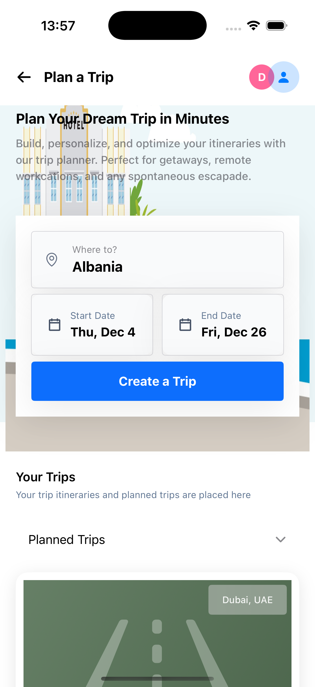
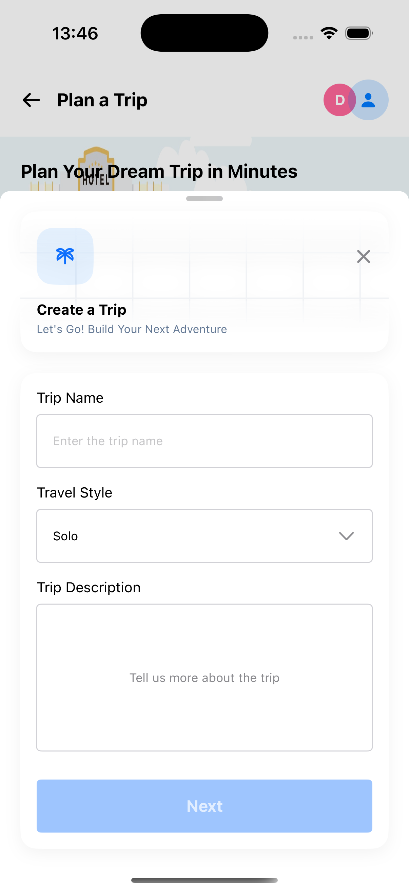
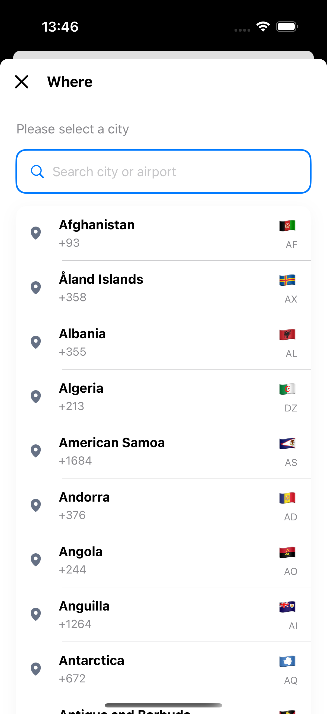
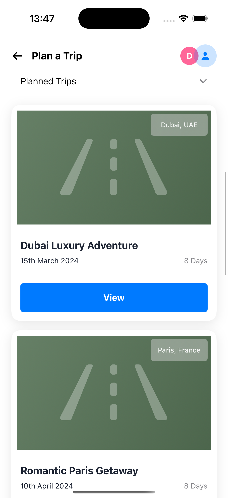
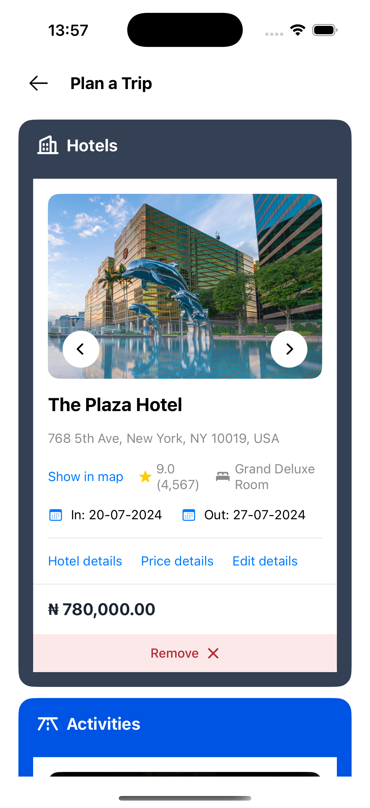
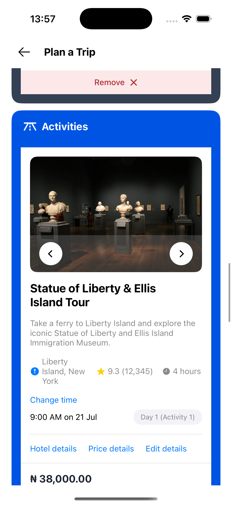

# Voyatek Group App - Trip Planning

A professional iOS application for planning and managing trips, built with SwiftUI and UIKit (programmatic), featuring comprehensive trip management with flights, hotels, and activities.

## Video Demo

**Complete App Walkthrough**: [Watch Full Demo](docs/videos/app_demo.mp4)

This comprehensive video demonstrates all features of the app including trip creation, itinerary management, and all interactive components.

## Overview

This application provides a complete trip planning and management system with the following features:
- **Plan Trips**: Create and manage your travel itineraries
- **Trip Details**: View comprehensive trip information with flights, hotels, and activities
- **Location Selection**: Browse and select destinations from a comprehensive country list
- **Date Range Picker**: Select travel dates with an intuitive date picker
- **Itinerary Management**: Add and manage flights, hotels, and activities for each trip
- **Professional UI**: Beautiful, responsive design matching Figma specifications
- **API Integration**: Full CRUD operations with REST API

## Architecture

### Project Structure

```
voyatekGroupApp/
├── Models/
│   ├── Trip.swift                    # Trip data model
│   ├── Flight.swift                  # Flight data model
│   ├── Hotel.swift                   # Hotel data model
│   └── Activity.swift                # Activity data model
├── Network/
│   ├── APIConfiguration.swift        # API configuration and endpoints
│   └── APIService.swift              # API service layer with trip operations
├── Components/
│   ├── TripCard.swift                # Trip card display component
│   ├── FlightCard.swift              # Flight card component
│   ├── HotelCard.swift               # Hotel card component
│   ├── ActivityCard.swift             # Activity card component
│   ├── ItineraryCard.swift           # Itinerary section card
│   ├── LocationPickerField.swift     # Location picker field
│   ├── DatePickerField.swift         # Date picker field
│   ├── PrimaryButton.swift           # Reusable button component
│   ├── LoadingView.swift             # Loading indicator component
│   └── ErrorView.swift               # Error display component
├── Views/
│   ├── PlanTripView.swift            # Main trip planning screen (SwiftUI)
│   ├── TripDetailViewController.swift # Trip detail screen (UIKit)
│   ├── CreateTripModalView.swift     # Create trip modal (SwiftUI)
│   ├── LocationPickerView.swift      # Location selection screen (SwiftUI)
│   ├── DateRangePickerView.swift     # Date range picker screen (SwiftUI)
│   └── UIKitTripBridge.swift         # SwiftUI-UIKit bridge
├── Utilities/
│   ├── AppColors.swift               # Color theme and utilities
│   ├── FontExtension.swift           # Custom font extensions
│   ├── CountryProvider.swift         # Country data provider
│   └── ViewExtensions.swift          # View utility extensions
└── Resources/
    ├── countries.json                 # Country data
    └── trips.json                     # Mock trip data
```

## 🛠️ Technologies Used

- **Swift 5.0+**
- **SwiftUI**: Modern declarative UI framework for main screens
- **UIKit (Programmatic)**: Traditional imperative UI framework for trip details
- **Async/Await**: Modern concurrency for network operations
- **URLSession**: Native networking framework
- **Custom Fonts**: Satoshi font family integration
- **JSON Parsing**: Native Codable protocol

## 📋 Requirements

- iOS 18.2+
- Xcode 16.2+
- Swift 5.0+

## 🚀 Setup Instructions

1. **Clone the repository**
   ```bash
   git clone <repository-url>
   cd voyatekGroupApp
   ```

2. **Open the project**
   - Open `voyatekGroupApp.xcodeproj` in Xcode

3. **Add Fonts** (if not already added)
   - Ensure Satoshi font files are included in the project
   - Add fonts to `Info.plist` under "Fonts provided by application"

4. **Build and Run**
   - Select your target device or simulator
   - Press `Cmd + R` or click the Run button
   - The app will build and launch automatically

## 🔌 API Integration

### Base URL
```
https://voyatek-tst.free.beeceptor.com/api/v1
```

### API Endpoints

| Method | Endpoint | Description |
|--------|----------|-------------|
| `GET` | `/trips` | Retrieve all trips |
| `GET` | `/trips/:id` | Get a single trip by ID |
| `POST` | `/trips` | Create a new trip |
| `PUT` | `/trips/:id` | Update entire trip object |
| `DELETE` | `/trips/:id` | Delete a trip |

### API Configuration

The app uses a centralized configuration system (`APIConfiguration.swift`) for managing API endpoints:

```swift
struct APIConfiguration {
    static let baseURL = "https://voyatek-tst.free.beeceptor.com/api/v1"
    
    enum Endpoint {
        case trips
        case trip(id: String)
        // ...
    }
}
```

### API Service Implementation

The `APIService` class handles all trip-related network operations:
- **Error Handling**: Comprehensive error types and messages
- **Response Validation**: HTTP status code validation
- **JSON Encoding/Decoding**: Automatic snake_case conversion
- **Timeout Configuration**: 30s request, 60s resource timeout
- **Debug Logging**: Detailed logging for troubleshooting

### Example Usage

```swift
// Fetch all trips
let trips = try await APIService.shared.fetchTrips()

// Create a trip
let newTrip = Trip(
    destination: "Paris, France",
    startDate: "2024-04-10T00:00:00Z",
    endDate: "2024-04-17T00:00:00Z",
    title: "Romantic Paris Getaway",
    travelStyle: "Romantic"
)
let createdTrip = try await APIService.shared.createTrip(newTrip)

// Fetch a single trip
let trip = try await APIService.shared.fetchTrip(id: "trip-001")

// Update a trip
let updatedTrip = try await APIService.shared.updateTrip(id: "trip-001", trip: trip)

// Delete a trip
try await APIService.shared.deleteTrip(id: "trip-001")
```

## 🎨 UI Screens & Components

### 1. Plan Trip View (SwiftUI)

**File**: `Views/PlanTripView.swift`

The main screen for planning and viewing trips.

**Features**:
- Fixed header with navigation and user profile
- Hero section with background image and call-to-action
- Location and date selection fields
- "Your Trips" section displaying all planned trips
- Pull-to-refresh functionality
- Loading and error states
- Navigation to trip details

**Screenshots**:
- 

**Key Components**:
- `PlanTripViewModel`: Manages trip data and API calls
- `TripCard`: Displays individual trip information
- `LocationPickerField`: Location selection input
- `DatePickerField`: Date range selection input

---

### 2. Trip Detail View (UIKit)

**File**: `Views/TripDetailViewController.swift`

Comprehensive trip details screen built programmatically with UIKit.

**Features**:
- Custom header with back button and title
- Background illustration image
- Trip information card (dates, title, location)
- Action buttons (Collaborate, Share, Options)
- Itinerary sections:
  - Flights section with flight cards
  - Hotels section with hotel cards
  - Activities section with activity cards
- Empty states for each itinerary type
- Fully responsive layout using Auto Layout

**Screenshots**:
- 
- 

**Key Components**:
- `PrimaryActionControl`: Custom UIControl for action buttons
- `FlightCard`: SwiftUI card embedded via UIHostingController
- `HotelCard`: SwiftUI card embedded via UIHostingController
- `ActivityCard`: SwiftUI card embedded via UIHostingController

---

### 3. Create Trip Modal (SwiftUI)

**File**: `Views/CreateTripModalView.swift`

Modal screen for creating a new trip.

**Features**:
- Header with icon and close button
- Trip name input field
- Travel style dropdown (Solo, Couple, Family, Group)
- Trip description text editor
- Form validation
- "Next" button with loading states
- 85% screen height presentation

**Screenshots**:
- 
- 

**Key Features**:
- Custom text field styling
- Dropdown menu for travel styles
- Text editor with placeholder
- Form validation before submission

---

### 4. Location Picker View (SwiftUI)

**File**: `Views/LocationPickerView.swift`

Screen for selecting a travel destination.

**Features**:
- Searchable country list
- Country information (name, dial code, flag)
- Custom navigation header
- Scrollable list with search functionality
- Integration with countries.json data

**Screenshots**:
- 
- 

**Data Source**:
- `Resources/countries.json`: Comprehensive country data
- `Utilities/CountryProvider.swift`: Country data provider

---

### 5. Date Range Picker View (SwiftUI)

**File**: `Views/DateRangePickerView.swift`

Screen for selecting travel dates.

**Features**:
- Calendar-based date selection
- Start and end date selection
- Date range validation
- Visual date highlighting
- Full-screen modal presentation

**Screenshots**:
- 
- 

---

## 🧩 Reusable Components

### Trip Card

**File**: `Components/TripCard.swift`

Displays trip information in a card format.

**Features**:
- Trip image with destination badge
- Trip title and dates
- Duration display
- Navigation to trip details
- Blur effect on destination badge

**Screenshot**:
- 

---

### Flight Card

**File**: `Components/FlightCard.swift`

Displays flight information.

**Features**:
- Airline logo (American Airlines)
- Flight number and airline name
- Departure and arrival information
- Flight duration with icons (AirplaneFlying, AirplaneLanding)
- Progress bar visualization
- Direct flight indicator
- Action links (Flight details, Price details, Edit details)
- Price section
- Remove button with confirmation

**Screenshots**:
- 
- 

---

### Hotel Card

**File**: `Components/HotelCard.swift`

Displays hotel information.

**Features**:
- Image slider with navigation buttons
- Hotel name and address
- Rating and review count
- Room type information
- Check-in/check-out dates
- Action links
- Price section
- Remove button

**Screenshots**:
- 
- 

**Image Assets**:
- Uses `hotel1` image from assets
- Image slider with grey overlay and circular navigation buttons

---

### Activity Card

**File**: `Components/ActivityCard.swift`

Displays activity information.

**Features**:
- Image slider with navigation buttons
- Activity name and description
- Location, rating, and duration
- Scheduled time and date
- Day and activity number badge
- Action links
- Price section
- Remove button

**Screenshots**:
- 
- 

**Image Assets**:
- Uses `activity1` image from assets
- Image slider with grey overlay and circular navigation buttons

---

### Itinerary Card

**File**: `Components/ItineraryCard.swift`

Displays itinerary section headers with empty states.

**Features**:
- Type-specific styling (Flights, Hotels, Activities)
- Custom background colors per type
- Icon display (AirplaneIcon, BuildingsIcon, RoadHorizonIcon)
- Empty state illustrations
- "Add" button for each type
- Responsive design

**Screenshots**:
- 
- 
- 

---

## Design System

### Colors

**File**: `Utilities/AppColors.swift`

Centralized color management:

```swift
enum AppColors {
    static let accentLabel = Color(hex: "#647995")
    static let planTripBackground = Color(hex: "#EDF7F9")
    static let dateFieldBackground = Color(hex: "#F9FAFB")
    static let primaryBlue = Color(hex: "#0D6EFD")
    static let primaryText = Color(hex: "#1D2433")
}
```

**Color Palette**:
- Primary Blue: `#0D6EFD`
- Primary Text: `#1D2433`
- Accent Label: `#647995`
- Plan Trip Background: `#EDF7F9`
- Date Field Background: `#F9FAFB`

### Typography

**Custom Font**: Satoshi

The app uses the Satoshi font family throughout:
- `Satoshi-Regular`
- `Satoshi-Medium`
- `Satoshi-Bold`

**Font Extension**: `Utilities/FontExtension.swift`

```swift
extension Font {
    static func satoshi(size: CGFloat) -> Font
    static func satoshiMedium(size: CGFloat) -> Font
    static func satoshiBold(size: CGFloat) -> Font
}
```

### Spacing & Layout

- Consistent padding: 16pt, 20pt
- Card corner radius: 4pt, 12pt, 16pt
- Section spacing: 8pt, 16pt, 20pt

## 📊 Data Models

### Trip Model

```swift
struct Trip: Codable, Identifiable, Hashable {
    let id: String?
    var destination: String
    var startDate: String
    var endDate: String
    var title: String?
    var travelStyle: String?
    var tripDescription: String?
    var imageUrl: String?
    var createdAt: String?
    var updatedAt: String?
    var flights: [Flight]?
    var hotels: [Hotel]?
    var activities: [Activity]?
}
```

### Flight Model

```swift
struct Flight: Identifiable, Codable, Hashable {
    let id: String
    let airline: String
    let flightNumber: String
    let departureTime: String
    let departureDate: String
    let departureAirport: String
    let arrivalTime: String
    let arrivalDate: String
    let arrivalAirport: String
    let duration: String
    let isDirect: Bool
    let price: String
}
```

### Hotel Model

```swift
struct Hotel: Identifiable, Codable, Hashable {
    let id: String
    let name: String
    let address: String
    let rating: Double
    let reviewCount: Int
    let roomType: String
    let checkInDate: String
    let checkOutDate: String
    let imageUrl: String?
    let price: String
}
```

### Activity Model

```swift
struct Activity: Identifiable, Codable, Hashable {
    let id: String
    let name: String
    let description: String
    let location: String
    let rating: Double
    let reviewCount: Int
    let duration: String
    let scheduledTime: String
    let scheduledDate: String
    let dayNumber: Int
    let activityNumber: Int
    let imageUrl: String?
    let price: String
}
```

## 🔄 SwiftUI-UIKit Integration

The app demonstrates seamless integration between SwiftUI and UIKit:

**UIKitTripBridge**: `Views/UIKitTripBridge.swift`

```swift
struct UIKitTripBridge: UIViewControllerRepresentable {
    let trip: Trip
    @Environment(\.dismiss) var dismiss
    
    func makeUIViewController(context: Context) -> TripDetailViewController {
        let controller = TripDetailViewController(trip: trip)
        controller.onDismiss = { dismiss() }
        return controller
    }
}
```

**Features**:
- SwiftUI views can embed UIKit view controllers
- Proper navigation stack management
- Data passing between frameworks
- Dismissal handling

## Key Features

### Trip Management
- ✅ Create new trips with destination, dates, and details
- ✅ View all trips in a scrollable list
- ✅ Navigate to detailed trip view
- ✅ View trip itineraries (flights, hotels, activities)
- ✅ Empty states for missing itinerary items

### User Experience
- ✅ Pull-to-refresh functionality
- ✅ Loading indicators during API calls
- ✅ Error messages with retry options
- ✅ Form validation
- ✅ Smooth animations and transitions
- ✅ Responsive design for different screen sizes

### Code Quality
- ✅ MVVM architecture pattern
- ✅ Separation of concerns
- ✅ Reusable components
- ✅ Comprehensive error handling
- ✅ Type safety
- ✅ Async/await for concurrency
- ✅ Professional code structure

### Design Fidelity
- ✅ Matches Figma design specifications
- ✅ Accurate spacing, fonts, and colors
- ✅ Custom icons from assets
- ✅ Professional UI/UX

## Implementation Details

### Error Handling

Comprehensive error handling throughout the app:

```swift
enum APIError: LocalizedError {
    case invalidURL
    case invalidResponse
    case httpError(statusCode: Int)
    case decodingError(Error)
    case networkError(Error)
    case unknown
}
```

### State Management

- **SwiftUI**: `@StateObject` and `@Published` for reactive updates
- **UIKit**: Traditional delegate patterns and closures
- **ViewModels**: `PlanTripViewModel` manages trip state

### Image Assets

The app uses various image assets:
- `tripBg`: Trip background image
- `planTripBg`: Plan trip background illustration
- `hotel1`: Hotel image
- `activity1`: Activity image
- `AirplaneIcon`, `BuildingsIcon`, `RoadHorizonIcon`: Itinerary icons
- `AirplaneFlying`, `AirplaneLanding`: Flight duration icons
- `AmericanAirline`: Airline logo
- `tripTreeIcon`: Trip creation icon
- `MapPinFill`, `MapPinOutline`: Location icons

## Testing

The project includes test targets:
- `voyatekGroupAppTests`: Unit tests
- `voyatekGroupAppUITests`: UI tests

Run tests with `Cmd + U` in Xcode.

## Dependencies

This project uses **no external dependencies**. All functionality is implemented using:
- Native iOS frameworks
- Swift standard library
- Foundation framework
- Custom fonts (Satoshi)

## 🎯 SwiftUI vs UIKit Coverage

### SwiftUI Implementation
- ✅ Plan Trip View (main screen)
- ✅ Create Trip Modal
- ✅ Location Picker View
- ✅ Date Range Picker View
- ✅ All reusable card components
- ✅ Form components
- ✅ App navigation structure

### UIKit Implementation
- ✅ Trip Detail View Controller (programmatic)
- ✅ Custom action buttons (PrimaryActionControl)
- ✅ Complex layout with Auto Layout
- ✅ Section headers and containers
- ✅ Image handling and display

## 🐛 Known Issues & Trade-offs

1. **API Response Format**: The API may return different response formats. The code handles both array and single object responses, as well as wrapped responses.

2. **Network Timeout**: Set to 30 seconds for requests. Adjust in `APIService` if needed.

3. **Error Messages**: Generic error messages for network failures. Consider adding more specific error handling for production.

4. **Offline Support**: Currently no offline caching. Consider implementing Core Data or UserDefaults for offline support.

5. **Image Caching**: Images are loaded directly without caching. Consider implementing image caching for better performance.

## 🔮 Future Enhancements

- [ ] Offline data persistence with Core Data
- [ ] Image upload support for trip photos
- [ ] Search and filter functionality for trips
- [ ] Pagination for large trip lists
- [ ] Unit and UI tests
- [ ] Dark mode optimizations
- [ ] iPad layout support
- [ ] Localization support
- [ ] Push notifications for trip reminders
- [ ] Share trip functionality implementation
- [ ] Collaboration features
- [ ] Trip templates
- [ ] Export trip as PDF

## 📸 Screenshots Directory

All screenshots should be placed in:
```
/docs/screenshots/
├── plan_trip_view.png
├── trip_detail_view.png
├── trip_detail_with_items.png
├── create_trip_modal.png
├── create_trip_modal_validation.png
├── location_picker_view.png
├── location_picker_search.png
├── date_range_picker.png
├── date_range_picker_selected.png
├── trip_card.png
├── flight_card.png
├── flight_card_remove.png
├── hotel_card.png
├── hotel_card_slider.png
├── activity_card.png
├── activity_card_scheduled.png
├── itinerary_card_flights.png
├── itinerary_card_hotels.png
└── itinerary_card_activities.png
```

## Video Demo

A complete walkthrough video demonstrating all features of the app:

**Full App Demo**:
- [Complete App Walkthrough](docs/videos/app_demo.mp4)

This video covers:
- Plan Trip View and trip creation
- Location and date selection
- Trip detail view with itineraries
- All interactive features and components

## 📄 License

This project is created for demonstration purposes.

## Author

Created by Micheal B. - 2025

## Acknowledgments

- Voyatek for the project requirements
- Beeceptor for providing the mock API endpoint
- Apple for SwiftUI and UIKit frameworks
- Figma for design specifications

---

**Note**: This application is built to demonstrate proficiency in both SwiftUI and UIKit programmatic approaches, following iOS best practices and design patterns. The app provides a complete trip planning experience with professional UI/UX matching design specifications.
